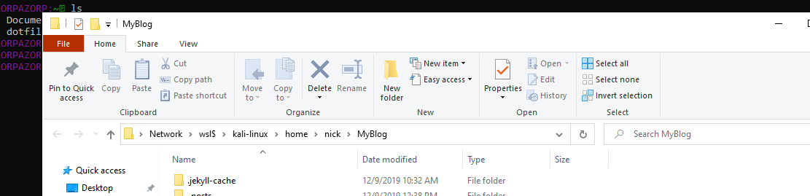

### WSL 2; The future?
Hello friends, today I want to talk about something that's made me very excited. And that's Microsoft's Windows Subsystem for Linux 2.  This won't be a how-to type of blog, rather just my opinion on why I think this innovating technology may be the way of the future. 

### Overview
Microsoft has claimed they wish to integrate Windows and Linux seamlessly for developers. With the emergence of WSL 2, they made big moves at achieving just that. A typical vm experience is isolated and uses limited system resources. However WSL 2 which utilizes a hyper-optimised linux kernel, that allows for full system resource utilization. 
Let's take a look at a few things that have allowed Microsoft to achieve this. 

### Plan 9
Microsoft chose out of all their choices, to use [Plan 9](https://9p.io/plan9/) from AT&T Labs. Ok, now my interest is piqued. They chose to use a proven system created by the jedi wizards Rob Pike, Ken Thompson and the rest of the Ma Bell crew. And so far to my limited testing, it's worked beautifully.  Linux files on Windows filesystem. Windows files on Linux filesystem. Using a storage drive with no problems. Seamless integration achieved.  

Using explorer.exe on my linux filesystem in this blog's repo  (I'm using Jekyll of course. :) )


### Linux Kernel!!
Real kernel.  Open source!!!! What?!? Someone wake [@LiveOverflow](https://twitter.com/LiveOverflow)! This really is about as game-changer as you can get in this department tho. I never in my wildest thought I'd ever type this out.... Here is the link to Microsoft open-source kernel's [Github](https://github.com/microsoft/WSL2-Linux-Kernel) page.  Pretty wild huh? What does that mean now? Basically, everything. 
>Linux binaries use system calls to perform many functions such as accessing files, requesting memory, creating processes, and more. Whereas WSL 1 used a translation layer that was built by the WSL team, WSL 2 includes its own Linux kernel with ***full system call compatibility***. This introduces a whole new set of apps that you can run inside of WSL, such as Docker and more. Additionally, any updates to the Linux kernel can be immediately ready to be added to your computer, rather than waiting for the WSL team to implement the changes and then have them added.
> Microsoft [Docs](https://docs.microsoft.com/en-us/windows/wsl/wsl2-about)

Ok, Microsoft, now you have my attention. 

### VS Code Integration
Remote headless VS Code server runs on WSL Linux.  GUI runs in Windows. So far no issues and it bridges the gap Windows has long had with development quite easily. Add in the Plan 9 server which makes dealing with the filesystem, no matter where/how, relatively painless now. Once you enable WSL Feature on Windows, and start VS Code, you'll be prompted to install the Remote extension. This is what makes that possible. Again showing that integration is a driving factor here. And it does it wonderfully with VS Code. Which was already my favorite editor. The coders amongst us will love the integrated experience.

## Memory Reclaim
Another huge milestone confirming in my heart that Microsoft is serious about integration and seamlessness is this dedicated improvement on an area long needing attention in the virtualization world. I've recently given up using Gnome Boxes as it was causing a random 90+G memory leak to occur often when I used it. I also remember experiencing similar issues with VirtualBox when I used that. WSL2 is already blazing fast because of the small micro-sized VM but what about when you throw some memory at it? What happens then? 


### memtest.c
```
#include <stlib.h>
#include <stio.h>
int main() {
	int i = 0;
	char* buffer = (char*) calloc(3000000000,1);

	printf("Done allocating\n");
	scanf("%d,&i);

	free(buffer);
	return 0;
}
```
This is a small memory test I took from [this](https://www.youtube.com/watch?v=K9GPOHrZgr4&t=74s) video from Microsoft's Craig Loewen, Program Manager for WSL. :) It just takes a random fair-sized piece of memory in a buffer and waits for a break but pay attention to not only my `htop` process in the tmux session in Linux, but also the `vmmem.exe` process in Task Manager as that is the WSL 2 VM...


As you can see, following the break when Linux was finished with the memory, it went away in both processes. I've tested this multiple times as I believe these are monumental steps for Microsoft based on historical analysis. I've observed both processes running my normal linux workload and it grew and shrank proportionately. All resource intensive linux programs I used were able to have full access and ran great. I was able to get a decent-ish recon workflow going using WSL to which some of my hacker friends will now know they can most assuredly attribute it to the WSL not me. ;) 


All tools that I use on Linux regularly for bug bounty, hacking/ctf worked no problem so far for me. I'm almost shockingly impressed by how much I like WSL 2. Everything I didn't like about WSL 1 when it first came out isn't even an issue anymore.  Microsoft has taken it very seriously.  Also, it seems these [guys](https://www.zdnet.com/article/canonical-makes-ubuntu-for-windows-subsystem-for-linux-a-priority/) are taking it seriously as well. I've even noticed as I've delved into Jekyll on WSL 2, that developers are taking it seriously. Everybody wants to improve WSL 2. I don't think I'm alone in thinking it's the future. 

Here while building with Jekyll is a thoughtful feed regarding a possible issue I may encounter if using Jekyll on WSL and the issue link included. I didn't have an issue at all. But it's nice to see that the drive to improve WSL seems to permeate everywhere now. And I think that's a good thing. 

To the unbelievers. To you naysayers. To you, who like me, grew up with a Microsoft that was unbending and didn't play well with others. Who feel it's only a matter of time, there is a trick, it's Microsoft. To you, I only have this;


 
                   

Yea that really happened. Until next time where we will talk about the ultimate hacking OS with ~~WSL and Docker~~. Oh wait. Well, it's out there now. So yea, utilizing docker containers and WSL to setup the ultimate hacking platform.  :)